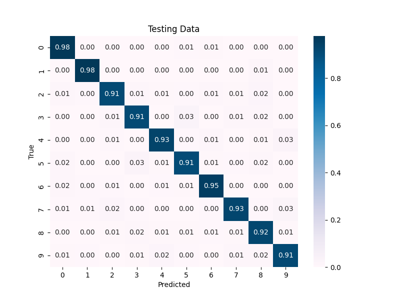

# Neural-Network-from-Scratch

This project implements a simple artificial neural network in Python using NumPy, capable of training and predicting on datasets.

## Features

- **Activation Functions:** Includes ReLU and softmax activation functions.
- **Training:** Implements mini-batch gradient descent with back-propagation.
- **Loss Calculation:** Uses mean squared error (MSE) loss function to measure performance during training.

## Usage

### Installation

```bash
git clone git@github.com:styxofsyntax/Neural-Network-from-Scratch.git
cd Neural-Network-from-Scratch
pip install -r requirements.txt
```

### Run Example Code

```bash
python mnist_train.py
```

## Structure

- `neural_network.py`: Contains the `NeuralNetwork` class with methods for initialization, forward propagation, back propagation, training and compute loss.
- `activations.py`: Containing activation functions and their derivatives.
- `mnist_train.py`: Example code to train and evaluate the neural network on MNIST dataset.
- `requirements.txt`: List of dependencies required to run the project.

**Note:** Example code includes scikit-learn for creating confusion matrices and tensorflow for loading the MNIST dataset. These packages are listed in the requirements.txt but are not essential for the core neural network implementation.

## Confusion Matrix



## Documentation

- [Mathematical Details](docs/mathematics.md)

## Resources

- [What is backpropagation really doing?](https://www.youtube.com/watch?v=Ilg3gGewQ5U)
- [Backpropagation calculus](https://www.youtube.com/watch?v=tIeHLnjs5U8)
